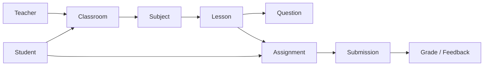

# 01 - Product Overview

## 1. Mục tiêu

Xây dựng hệ thống học tập gồm 2 nhóm người dùng chính:
- `Teacher`: tạo và quản lý nội dung học
- `Student`: học bài và làm bài tập

## 2. Phạm vi v1

- Quản lý lớp học
- Quản lý môn học trong lớp
- Quản lý bài học trong môn
- Quản lý câu hỏi trong bài học
- Học sinh làm và nộp bài
- Giáo viên chấm điểm cơ bản

## 3. Sơ đồ tổng quan

## 4. Module chức năng

- `Auth & User`: đăng nhập, phân quyền
- `Classroom`: lớp học, thành viên lớp
- `Subject`: môn học theo lớp
- `Lesson`: nội dung bài học (text, ảnh, file)
- `Assessment`: câu hỏi, bài tập, bài nộp, chấm điểm

## 5. Nguyên tắc nghiệp vụ

- Teacher chỉ quản lý lớp/môn/bài của mình
- Student chỉ truy cập lớp đã tham gia
- Không lộ đáp án đúng trước khi nộp (nếu cấu hình)
