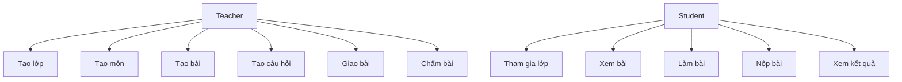

# 02 - Use Cases

## 1. Actor

- `Teacher`
- `Student`
- `Admin` (optional, cho vận hành hệ thống)

## 2. Teacher Use Cases

| ID | Use case | Mô tả ngắn |
|---|---|---|
| T-01 | Tạo lớp học | Tạo lớp với tên, mô tả, mã lớp |
| T-02 | Quản lý môn học | Tạo/sửa/xóa môn trong lớp |
| T-03 | Quản lý bài học | Tạo/sửa/xóa bài học trong môn |
| T-04 | Quản lý nội dung bài | Thêm text, ảnh, file, liên kết |
| T-05 | Quản lý câu hỏi | Tạo câu hỏi trắc nghiệm/tự luận |
| T-06 | Giao bài | Chọn bài học, hạn nộp, số lần nộp |
| T-07 | Chấm bài | Chấm điểm và feedback |

## 3. Student Use Cases

| ID | Use case | Mô tả ngắn |
|---|---|---|
| S-01 | Tham gia lớp | Vào lớp bằng mã hoặc được thêm |
| S-02 | Xem môn học | Xem danh sách môn trong lớp |
| S-03 | Xem bài học | Đọc nội dung, xem ảnh/file |
| S-04 | Làm bài | Trả lời câu hỏi |
| S-05 | Nộp bài | Nộp bài và lưu thời điểm nộp |
| S-06 | Xem kết quả | Xem điểm và feedback |

## 4. Use case map

## 5. Acceptance criteria mẫu (v1)

- Khi teacher tạo lớp thành công, hệ thống trả về mã lớp duy nhất.
- Khi student chưa tham gia lớp, student không xem được nội dung lớp.
- Khi đã quá hạn và `allowLate=false`, hệ thống từ chối nộp bài.
