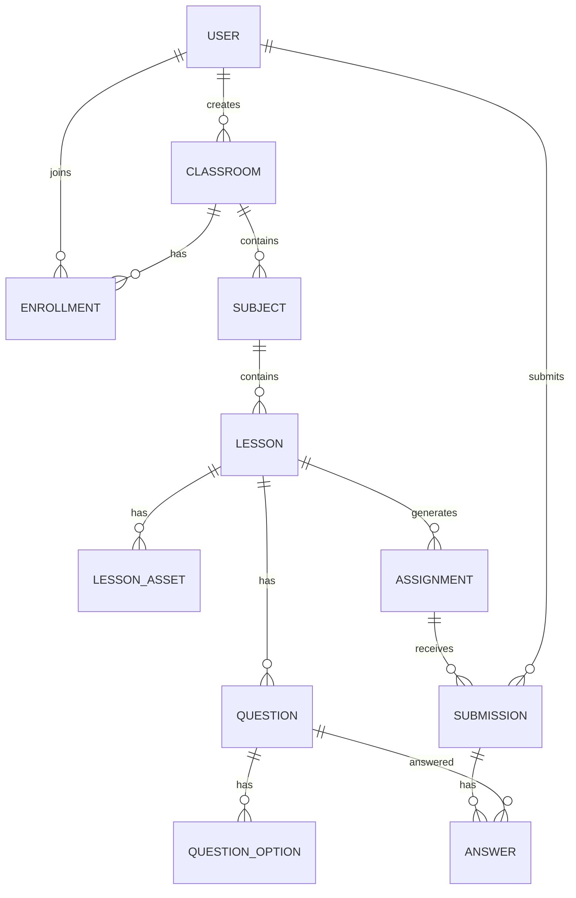

# 03 - Data Model (ERD)

## 1. Thực thể chính

- `User`
- `Classroom`
- `Enrollment`
- `Subject`
- `Lesson`
- `LessonAsset`
- `Question`
- `QuestionOption`
- `Assignment`
- `Submission`
- `Answer`

## 2. ERD



## 3. Thiết kế bảng gợi ý (rút gọn)

### `users`
- `id`, `name`, `email`, `password_hash`, `role`, `status`, `created_at`

### `classrooms`
- `id`, `name`, `description`, `code`, `teacher_id`, `created_at`

### `subjects`
- `id`, `classroom_id`, `name`, `display_order`

### `lessons`
- `id`, `subject_id`, `title`, `content`, `is_published`, `display_order`

### `questions`
- `id`, `lesson_id`, `type(mcq|essay)`, `content`, `points`, `display_order`

### `assignments`
- `id`, `lesson_id`, `due_at`, `allow_late`, `max_attempts`

### `submissions`
- `id`, `assignment_id`, `student_id`, `status`, `submitted_at`, `score`, `feedback`

## 4. Ràng buộc cần có

- `classrooms.code` unique
- `users.email` unique
- Soft delete (`voided`) cho entity quan trọng
- FK đầy đủ cho luồng teacher -> lớp -> môn -> bài -> bài nộp

## 5. Quy tắc bắt buộc cho mọi bảng (Global Table Rule)

Mọi bảng nghiệp vụ mới phải có tối thiểu 3 cột chuẩn:
- `created_at`
- `updated_at`
- `voided`

Mẫu SQL gợi ý:

```sql
created_at TIMESTAMP NOT NULL DEFAULT CURRENT_TIMESTAMP,
updated_at TIMESTAMP NOT NULL DEFAULT CURRENT_TIMESTAMP ON UPDATE CURRENT_TIMESTAMP,
voided BOOLEAN NOT NULL DEFAULT FALSE
```

Nguyên tắc áp dụng:
- Không xóa cứng bản ghi nghiệp vụ; ưu tiên soft delete qua `voided = true`.
- Query mặc định ở service/repository luôn lọc `voided = false`.
- Migrations mới phải tuân thủ rule này trước khi merge.
