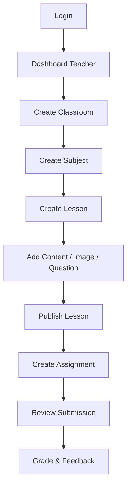
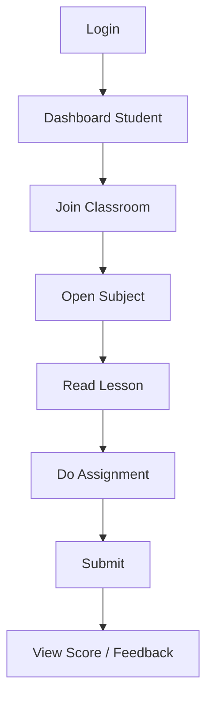

# 04 - User Flow

## 1. Teacher flow

## 2. Student flow

## 3. Màn hình cần có (v1)

- Teacher
  - Danh sách lớp
  - Chi tiết lớp + danh sách môn
  - Danh sách bài theo môn
  - Soạn bài học + quản lý câu hỏi
  - Danh sách bài nộp

- Student
  - Lớp của tôi
  - Danh sách môn và bài học
  - Màn làm bài
  - Lịch sử bài nộp

## 4. Điểm cần chú ý UX

- Autosave khi làm bài
- Hiển thị deadline rõ ràng
- Cảnh báo chưa nộp khi sắp hết hạn
- Teacher có filter theo lớp/môn/học sinh
